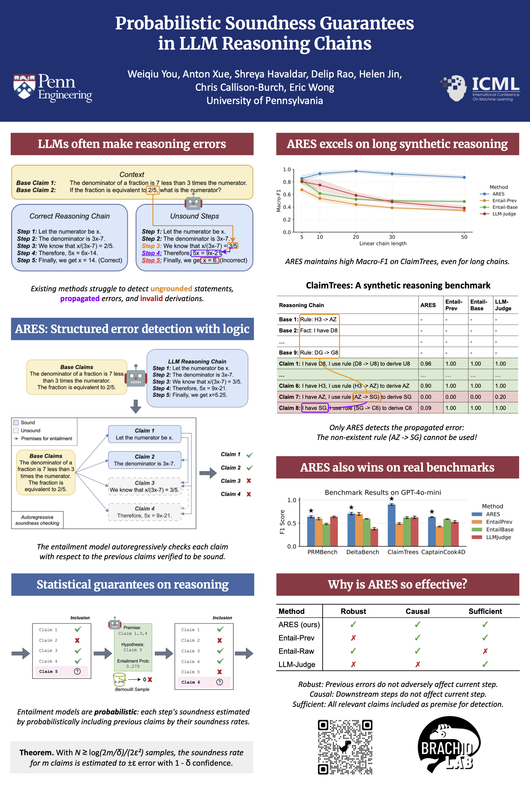

# ARES (Autoregressive Reasoning Entailment Stability)
Official repository for "Probabilistic Soundness Guarantees in LLM Reasoning Chains"

[[Paper](https://arxiv.org/abs/2507.12948)]

- [x] Release code: Mid Aug 2025



# Install environment
```
conda create -n ares python=3.10
conda activate ares
pip install -r requirements.txt
```

# Demo notebook
Check out this [demo notebook](ares/notebooks/exp_stability_cert_binary_synthchain3_no_repeat_10_2_no_cot_prompt1_entailment_prompt_p0.95.ipynb) for ClaimTrees length 10 using ARES with prior probability 0.95.